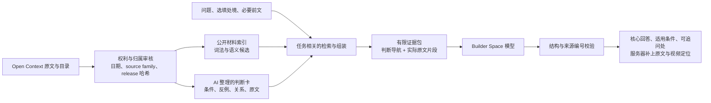

# 从材料到回答

问问立正的质量取决于是否能找到有关的判断、理解它成立的条件，并把它用到当前问题。单独加一个向量数据库不会完成这件事。第一版把 Context infra 明确分为离线供应与在线组装两部分。

## 离线：材料有版本，提炼有依据

Open Context 是唯一内容所有者。产品仅复制公开 release manifest 列出的文件，并校验 SHA256；原始缓存、私人消息、用户记忆和未发布稿件不进入产品。原文、翻译、嘉宾发言、发布者和 AI 整理保持各自的归属。相同源材料的原文与翻译按 source family 去重。

`context/decision-cards.json` 覆盖十七组常见问题：九月底的八组来自近期文章与视频，十月初补的八组以《真本事》课程文字稿为原文依据（职业选择、个人价值公式、高价值工作、三种思维、财务与投资、手艺与坚持、赚钱这门手艺、沟通），另一组来自会员节目 Marketplace 系列（坏消息要说实话，也要让人接得住）。卡片也引用经核对为立正一人主讲的会员视频；多人对话不作为卡片依据。每卡包含待理解的判断、成立条件、不能推出的结论、诊断问题，以及指向原文的 basis、contrast、case。卡间关系可以提示同一机制、适用范围不同或具体案例，但不能证明作者创立了一个新的统一理论。

卡片由 AI 整理，属于 secondary synthesis，不是立正本人逐条确认的公理。每个引用路径必须是当前公开 manifest 里的真实正文；运行时核对哈希、类型、关系与来源。没有实际进入证据包的 basis，卡片就不提供给回答模型。卡片本身不能获得可引用的 S 编号。

日期不是简单的“新文章优先”。例如七月的 Don't build 讨论生产系统的 ownership，九月的假学习继续强调 build 的学习价值。产品需要同时保留两个语境。自媒体伴读里也保留这次建议与早先建议的变化，以及尚未达成一致的部分。更新时检查受影响卡片，而不是自动宣布新文推翻旧文。

## 在线：按问题组装，回原文验证

词法检索保留精确名词、文章标题、子问题覆盖与时间定位。语义检索补足用户换一种说法时的召回；它返回候选，不代表这些候选可以证明某个立场。两路通过排名融合选择候选，判断卡补入必要的基础与边界材料。语义服务失败时仍可使用词法和卡片检索。

证据包按不同源材料去重，并限制数量和每份片段长度。普通问题用当前问题主导；指代式追问可以借助前文恢复主题，明确的新主题不会沿用旧答案强行回答。用户背景是用户陈述，不与已核实的资料事实混为一谈。

回答模型需要解释问题里的关系与取舍，结构服从问题；不把卡片变成每个人都必须执行的步骤。AI 综合、材料转述、联系用户处境的推演分别标注。缺少关键个人条件时先答已知部分，最多追问两个实质缺口。材料外的问题应说明不足。

模型只返回已经提供的来源编号。链接、日期、摘录、时间码由服务器产生；元数据条目只可用于发现内容，不能支撑材料性结论。结构校验失败仅做一次定向修复，服务失败则展示确实检索到的材料。结构与编号通过不等于内容理解必然正确，仍需要真实问题的人工评估。

## 与鸭哥项目的关系

[context-infrastructure](https://github.com/grapeot/context-infrastructure) 提供的是分层积累、提炼与按需加载的参考实现。这里采用这些结构思想，不复制他的身份、判断公理、私人记忆或观察任务。

其语义检索已拆为 [semantic-search-skill](https://github.com/grapeot/semantic-search-skill)。目前实现使用 SQLite 和分段 float32 向量的 mmap，适合参考索引与正文分离、只读查询和增量构建的方式。产品需要适应 Builder 的 256 MB 容器、公开 release 哈希与容器路径，所以不能直接搬入本机绝对路径缓存，也不能在公共问答请求里自动扫描和改写源材料。

问问立正不从读者聊天自动反推“立正的观点”。后续升级以新的第一方资料、纠错与具体评估失败为输入，先更新内容所有者，再构建索引并验证。这个供应链与公开发布保持各自的审阅边界。

## 判断这一层是否有效

至少比较五类结果：换说法是否仍找到正确原文；不同范围的观点是否同时保留；嘉宾与 AI 整理是否被错误算作本人立场；具体建议是否考虑用户约束；材料不足时是否坦诚说明。预填问题只是入口，测试还需要未在卡片中照抄的表达、多轮追问和明显不在材料范围内的问题。
